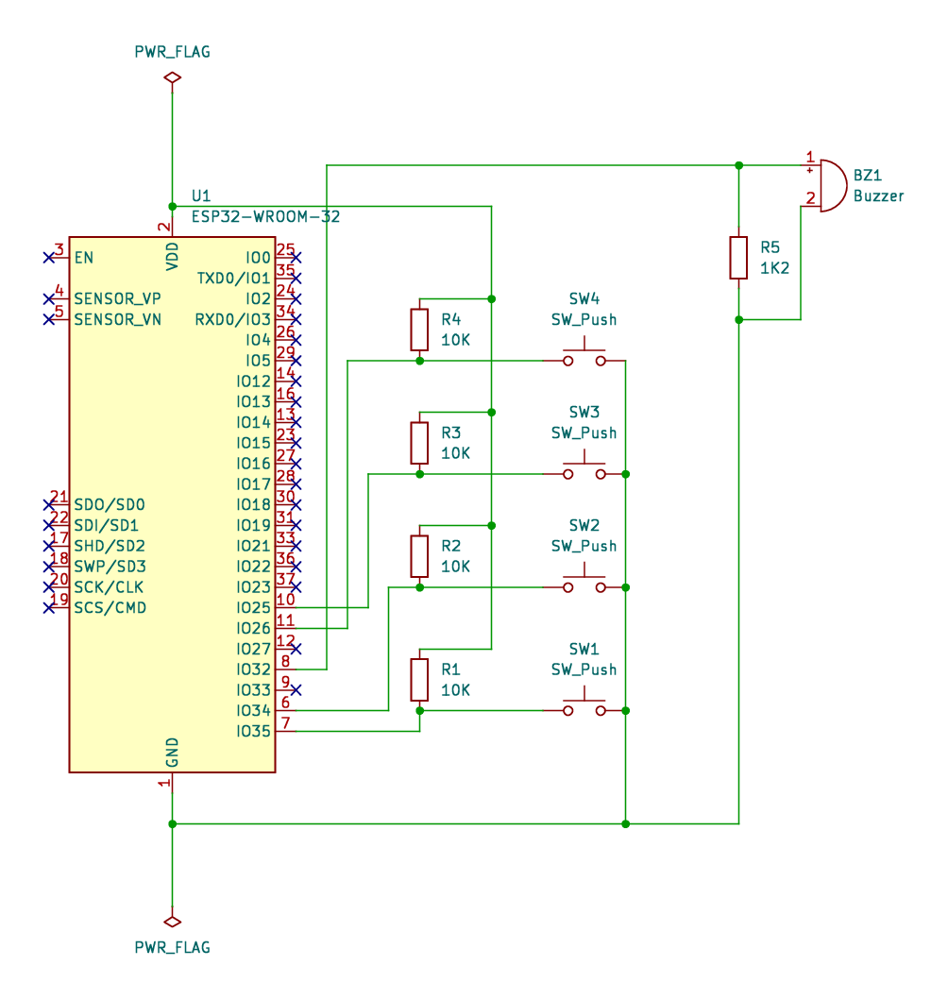

# off-alarm bedside device

This directory contans code for the off-alarm bedside device. This program is built on the Espressif IoT Development Framework (ESP-IDF) and should run on most development boards using the ESP32 family of microcontrollers.

## Operation

The program assumes the ESP32 device is connected to four push-buttons and a passive piezoelectric buzzer. Each of the buttons represents an event the user wants to send to the off-alarm server such as `in_bed` ("I'm now in bed"), `awake` ("I'm awake now"), `up_from_bed` ("I've gotten up from bed"), and `check_status` ("Which of the three states does the server think I'm in now?").

When a button is pressed, a message is sent on the 'event' topic over MQTT to let the server know the user pressed a specific button. A distinct tune is played for each of the buttons to let the user know the button press was registered by the bedside device. When the server successfully receives the button press event message, it will send a message on the 'command' topic over MQTT to have the bedside device play a "receive confirmation tune." The server receive confirmation tunes are initial button press confirmation tunes played in reverse at double speed.

`check_status` works slightly differently. It has its own button press confirmation tone, but the server receive confirmation tone is that of last status change that was received by the server.

## Device schematics

The code was tested on a WEMOS LOLIN32 developed board with the ESP-WROOM-32 module. The push-buttons and the passize piezoelectric buzzer were connected as described in the schematics.

## Troubleshooting

The repository does not contain configuration files that the ESP-IDF extension for VS Code would automatically generate if you created a new project yourself as these files contain absolute paths that are dependent on the OS and the developer's local installation path for the ESP-IDF.

If you have trouble compiling this code on your machine, try creating an empty project using the ESP-IDF extension and copying the files in `main` directory.

The code was written and tested on ESP-IDF v5.4. It may not work with a different version.

## Configuration

Run the following in an ESP-IDF terminal to configure the device.

`idf.py menuconfig`

If the terminal complains about not finding idf.py, your terminal is not properly configured with the ESP-IDF paths. Refer to the ESP-IDF documentation.

In the configuration menu, scroll down to `off-alarm Configuration` and press enter.

Here, you must configure:

- Wi-Fi SSID (the access point or the router your device will connect to)
- Wi-FI password
- MQTT server URI
- MQTT username
- MQTT user password
- MQTT topic from which the device will receive command messages
- MQTT topic to which the device will send (button press) event messages
- GPIO pins for the push-buttons
- GPIO pin for the passive piezoelectric buzzer

Otherwise, the device binary will be built with the default settings, and it will not be able to connect, detect button presses, or play sound on the buzzer.

Of course, the off-alarm server, which is in `../src` directory must already be properly configured and running. Refer to the documentation in `../` to get the server up and running.
